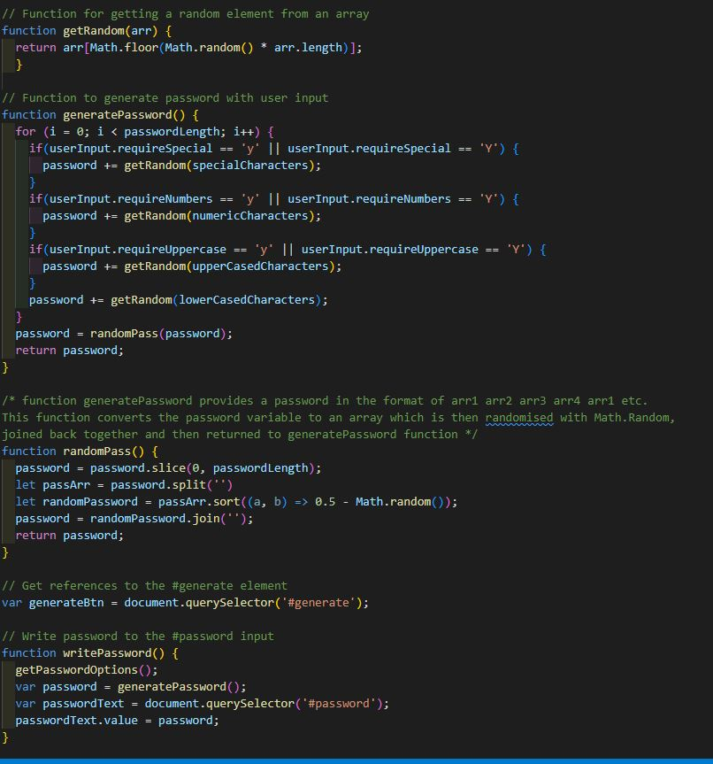
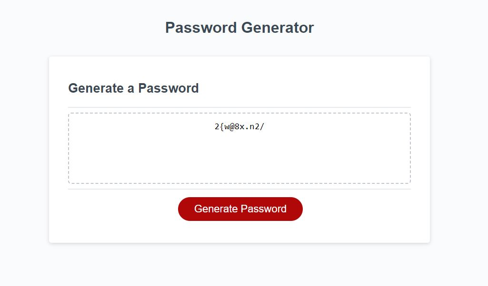

# Password Generator

## Overview

A configurable password generator that returns a random string of lowercase, uppercase, numbers, and special characters.

## Site & Repo
* [Site](https://dj-86.github.io/password-generator/)
* [Repo](https://github.com/DJ-86/password-generator)

## Acceptance Criteria

## Resources:
* [While loops](https://developer.mozilla.org/en-US/docs/Web/JavaScript/Reference/Statements/while)
* [Math.random](https://developer.mozilla.org/en-US/docs/Web/JavaScript/Reference/Global_Objects/Math/random)

## Screenshots
;

## License
* [MIT](LICENSE.md)
